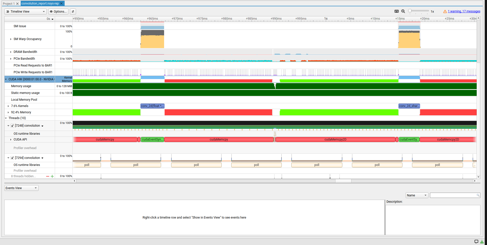
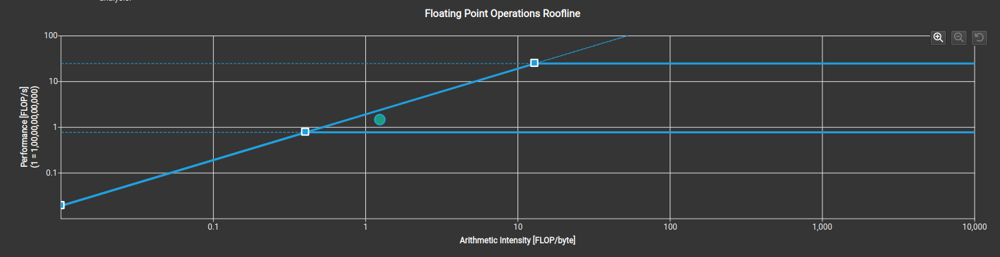
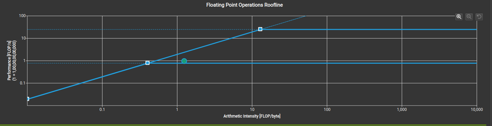
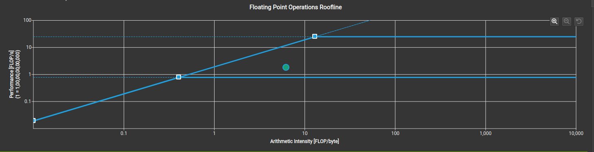
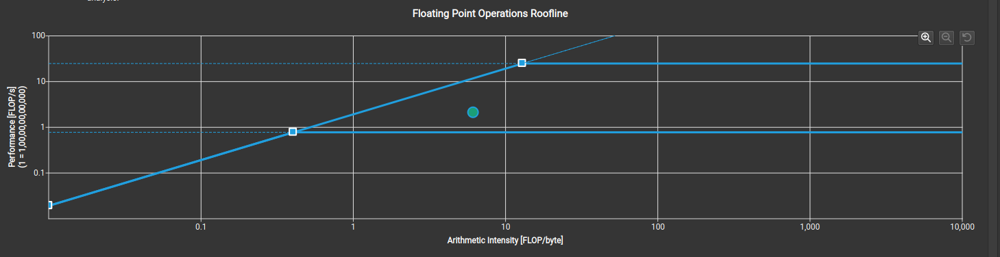

# Convolution

CUDA implementations of 1D and 2D convolution, each with a naive (global-memory)
baseline and a shared-memory tiled variant. Includes benchmarking with
`cudaEvent`s and profiling notes from Nsight Systems and Nsight Compute.

## Table of contents

- [What is convolution](#what-is-convolution)
- [Implementations](#implementations)
- [`__constant__` memory](#__constant__-memory)
- [`cudaMallocPitch`](#cudamallocpitch)
- [Measured results: naive vs. shared](#measured-results-naive-vs-shared)
- [Profiling with Nsight Systems](#profiling-with-nsight-systems)
- [Profiling with Nsight Compute](#profiling-with-nsight-compute)
- [Compiling and running](#compiling-and-running)

## What is convolution

Convolution computes each output element as a weighted sum of the input
elements in a neighborhood around it, using a small, fixed kernel of weights
(the *mask*). For 1D input `N` and mask `M` of width `maskW`:

```
P[i] = sum over k of M[k] * N[i - maskW/2 + k]
```

2D convolution applies the same idea over two axes with a `maskW x maskW`
mask. Mask taps that fall outside the input bounds are treated as zero
(zero-padding) rather than read.

Each output element requires `maskW` (1D) or `maskW x maskW` (2D)
multiply-adds but touches roughly that many input elements to do it — a low
ratio of arithmetic to data movement. This makes convolution with a small
mask a classic memory-bound workload, a property that shapes both the
optimizations below and the profiling results later in this document.

## Implementations

All four kernels live in [convolution.cu](convolution.cu).

### `conv_1d` — naive baseline

One thread per output element. Each thread reads its `maskW`-element window
directly from global memory:

```cpp
__global__ void conv_1d(float *N, float *M, float *P, int maskW, int width)
```

Neighboring threads' windows overlap heavily — with `maskW = 5`, each input
element is re-read from global memory up to 5 times across the block.

### `conv_1d_shared` — halo-tiled

Same math as `conv_1d`, but each block first stages its input tile (plus a
halo) into `__shared__` memory once; every thread then reads from shared
memory instead of global memory.

Each block owns an output range of `o_tile_width` elements. The block is
launched *wider* than that range so its edge threads can also load the halo:

```cpp
int index_o = blockIdx.x * o_tile_width + threadIdx.x;  // this thread's output position
int index_i = index_o - (maskW / 2);                    // shifted left by the halo
```

`index_i` is offset `maskW/2` elements before `index_o`, so `threadIdx.x == 0`
loads the *left halo* — the elements just outside this block's output range
that its edge threads still need for their mask window — rather than the
tile's first real element. Loads outside `[0, width)` are zero-padded into
shared memory instead of read.

Because the load is shifted but the compute loop isn't
(`d_N[threadIdx.x + i]`, not `d_N[threadIdx.x - maskW/2 + i]`), reading
shared memory starting at `threadIdx.x` lands exactly on the `maskW`-wide
window centered on `index_o` — the shift at load time is what makes the
unshifted read at compute time correct.

This is also why the block is launched with
`blockDim.x = o_tile_width + maskW - 1` (1024 threads for a 1020-element
output tile with a 5-wide mask): the extra `maskW - 1` threads exist purely
to load the halo, and only the first `o_tile_width` threads go on to compute
and write an output (`threadIdx.x < o_tile_width`). The `index_o < width`
check alongside it matters independently — the last block's threads can
still run past the end of `N`, since `o_tile_width` doesn't evenly divide
`width` in general.

### `conv_2d` — naive baseline

One thread per output pixel, mask applied as a `maskW x maskW` square over
both axes. Still reads `N` directly from global memory per tap — redundancy
here is quadratic in `maskW`, worse than `conv_1d`'s linear redundancy.

### `conv_2d_shared` — halo-tiled, constant-memory mask, pitched allocation

Extends the `conv_1d_shared` tiling to both axes (`index_i_row`/`index_i_col`
each offset by `maskW / 2`, shared tile indexed `d_N[threadIdx.y][threadIdx.x]`,
compute loop reading the unshifted `d_N[threadIdx.y + i][threadIdx.x + j]`
window), and layers two further techniques on top: the mask is read from
`__constant__` memory instead of a pointer parameter, and `N`/`P` are
allocated with `cudaMallocPitch` instead of flat `width * height` blocks.
Both are covered in detail below.

## `__constant__` memory

**What it is.** A dedicated read-only memory space, backed by a cache
optimized for the case where many threads read the *same* address at the
same time (broadcast), rather than each thread reading a different address.

**Why it's used here.** In `conv_2d_shared`'s compute loop, every thread in a
warp reads `d_M[i * maskW + j]` at the same index on the same iteration.
Serving that from `__constant__` memory costs one broadcast read for the
whole warp, versus a separate global-memory load per thread for `conv_2d`'s
`M[i * maskW + j]`. The mask is small (`maskW x maskW`, capped at
`MAX_MASK_WIDTH x MAX_MASK_WIDTH`) and read-only for the duration of the
kernel — exactly the access pattern `__constant__` memory is built for.

**How it's used in this implementation.** The mask is declared file-scope
instead of passed as a kernel parameter:

```cpp
#define MAX_MASK_WIDTH 5
__constant__ float d_M[MAX_MASK_WIDTH * MAX_MASK_WIDTH];
```

`MAX_MASK_WIDTH` becomes a compile-time cap in exchange for the broadcast
read — a runtime-sized mask isn't possible with this approach.

The mask is copied in before launch with `cudaMemcpyToSymbol`, not
`cudaMemcpy`:

```cpp
float *h_M2d = (float *)malloc(maskW2d * maskW2d * sizeof(float));
// ... filled with random values ...
cudaMemcpyToSymbol(d_M, h_M2d, maskW2d * maskW2d * sizeof(float));
```

The destination is the `__constant__` symbol `d_M` itself, not a device
pointer from `cudaMalloc` — `cudaMemcpyToSymbol` resolves `d_M`'s device
address and copies directly into it. Nothing in the type system enforces
that this call happens before the kernel launch that reads `d_M`; only call
order does.

> **Note.** During development, `main()` briefly declared a local
> `float *d_M` for the (at the time) unfilled `conv_1d` call, which shadowed
> the file-scope `__constant__ d_M` for the rest of `main()`.
> `cudaMemcpyToSymbol(d_M, ...)` then silently resolved to that local,
> uninitialized pointer instead of the constant symbol, failing with
> `invalid device symbol` — the mask was never copied, and `conv_2d_shared`
> ran against whatever was already in constant memory. The call itself was
> well-typed throughout; it simply bound to the wrong symbol. Local names
> that collide with a `__constant__`/`__device__` symbol are worth avoiding
> for exactly this reason. (The 1D naive kernel's mask pointer is `d_M1d`
> today, clear of any name collision.)

## `cudaMallocPitch`

**What it is.** A device allocator for 2D data that pads each row up to a
hardware-friendly alignment, rather than packing rows back-to-back. It
returns the real per-row byte stride (the *pitch*) alongside the pointer,
since that stride is no longer equal to `width * sizeof(float)`.

**Why it's used here.** A flat `width * height` allocation starts row `r` at
byte offset `r * width * sizeof(float)`, which may not satisfy the alignment
the memory controller wants for each row's first element. `cudaMallocPitch`
guarantees row-start alignment by padding, trading a small amount of unused
memory per row for more efficient row-aligned access.

**How it's used in this implementation.** `conv_2d_shared`'s input and
output buffers are allocated with the pitched API:

```cpp
float *d_N2ds, *d_P2ds;
size_t pitchN2ds, pitchP2ds;
cudaMallocPitch(&d_N2ds, &pitchN2ds, rowBytes2d, height2d);
cudaMallocPitch(&d_P2ds, &pitchP2ds, rowBytes2d, height2d);
```

The kernel must index rows by the reported pitch, not the logical `width`,
or it reads into row padding — or the next row — instead of the intended
data:

```cpp
const float *N_row = (const float *)((const char *)N + index_i_row * pitchN);
d_N[threadIdx.y][threadIdx.x] = N_row[index_i_col];
...
float *P_row = (float *)((char *)P + index_o_row * pitchP);
P_row[index_o_col] = pVal;
```

The cast to `char *` before adding the pitch is required: `pitchN`/`pitchP`
are byte offsets, so adding them directly to a `float *` would advance by
that many `float`s — four times too far — instead of that many bytes.
Host-side transfers into and out of pitched buffers use `cudaMemcpy2D`
rather than `cudaMemcpy`, for the same reason.

## Measured results: naive vs. shared

`main()` runs each pair — `conv_1d`/`conv_1d_shared` and
`conv_2d`/`conv_2d_shared` — on the same random input, timed with
`cudaEvent`s, so the numbers below are a direct, apples-to-apples
naive-vs-tiled comparison rather than two separately sized runs. This is a
pure timing harness (real allocation, real random input, `cudaEvent`-timed
launches); each kernel's output was verified against a CPU reference during
development, but `main()` itself does not re-check correctness on every run.

`main()` calls `warmupGPU()` before any timed section, launching all four
kernels once, untimed, on small zeroed buffers. Without this, whichever
kernel launches first (`conv_1d`) absorbs one-time costs — CUDA context
initialization, module load, GPU clocks ramping up from an idle power
state — that are unrelated to the kernel itself, inflating its time and
making later kernels look artificially better by comparison.

GPU kernel time only (excludes H2D/D2H transfer), measured on a GTX 1650,
post-warmup:

| Kernel | Input | Mask | Kernel time |
|---|---|---|---|
| `conv_1d` | 16,777,216 elements (1D) | 5 | ~0.98–1.00 ms |
| `conv_1d_shared` | 16,777,216 elements (1D) | 5 | ~1.47–1.48 ms (0.66–0.67x — *slower*) |
| `conv_2d` | 4096 x 4096 elements (2D) | 5x5 | ~3.79–3.81 ms |
| `conv_2d_shared` | 4096 x 4096 elements (2D) | 5x5 | ~3.27–3.28 ms (1.16x) |

Before `warmupGPU()` existed, `conv_1d` measured ~2.0–2.4 ms and
`conv_1d_shared` appeared ~1.1–1.3x faster; that gap was mostly the
cold-clock penalty landing on `conv_1d` because it launched first, not a
real tiling advantage.

With clocks already warm, `conv_1d_shared` is consistently *slower* than the
naive kernel: at `maskW = 5`, 1D redundancy is small enough that the GTX
1650's L1/L2 already absorbs most of the reuse even in the naive kernel, so
the `__syncthreads()` and shared-memory staging overhead in `conv_1d_shared`
costs more than it saves. `conv_2d_shared` still wins because 2D redundancy
is quadratic in `maskW` (up to 25 global reads per input element vs. 1),
which is enough to outweigh the same tiling overhead. Tiling would likely
pay off more visibly in 1D too with a wider mask.

## Profiling with Nsight Systems

```bash
nsys profile --trace=cuda,osrt --stats=true ./convolution
```

On a GTX 1650, this shows transfer time dwarfing compute:
`cuda_gpu_mem_time_sum` totals ~151 ms of H2D+D2H copies across the run,
versus ~12.3 ms of `cuda_gpu_kern_sum` kernel execution — transfers are
~12x the compute.

Overlapping memcpy with compute (streams and pinned host memory) only hides
the *smaller* of the two; whichever side is larger still sets the floor on
total time. Here that's transfers, so the higher-leverage fix is
shrinking/speeding up the copies themselves (pinned memory, fewer/larger
transfers) rather than overlap alone — overlap becomes worthwhile on top of
that once compute is no longer trivially smaller than transfer.



## Profiling with Nsight Compute

**Compute-bound or memory-bound?** As noted above, convolution with a small
mask is a classic memory-bound operation. The prediction going into
profiling: all four kernels should be memory-bound, not compute-bound.

Roofline data was collected per kernel with:

```bash
sudo ncu --set full --section SpeedOfLight_RooflineChart \
  --launch-skip 4 --launch-count 4 \
  --export convolution_ncu_report ./convolution
```

`--launch-skip 4` skips `warmupGPU()`'s 4 untimed launches, so the 4
profiled launches are the real, timed kernels. The result was opened with
`ncu-ui convolution_ncu_report.ncu-rep` (`sudo chown $USER
convolution_ncu_report.ncu-rep` may be needed first, since `ncu` ran as
root), selecting each kernel launch, then **Details → GPU Speed Of Light
Throughput**, switching the content-selector dropdown from "GPU Throughput
Chart" to **"GPU Throughput Roofline"** — the FP32/FP64 chart matching
`SpeedOfLight_RooflineChart` above. (The Half/Single-hierarchical/Tensor
Core options are separate sections this command didn't collect, and don't
apply here — none of these kernels use `__half` or tensor-core
instructions.)

| Kernel | Duration | % of FP32 peak | Achieved DRAM BW | % of peak BW (~192 GB/s) | `ncu`'s verdict |
|---|---|---|---|---|---|
| `conv_1d` | 1.18 ms | 6% | 114.1 GB/s | ~60% | Latency issue |
| `conv_1d_shared` | 1.80 ms | 4% | 74.3 GB/s | ~39% | Latency issue |
| `conv_2d` | 4.71 ms | 7% | 28.5 GB/s | ~15% | Well-balanced (compute & memory both low) |
| `conv_2d_shared` | 4.07 ms | 8% | 33.3 GB/s | ~17% | Latency issue |

**`conv_1d`** — dot sits just under the memory-bandwidth diagonal, the
closest of the four to its own roofline:



**`conv_1d_shared`** — dot sits further below the diagonal than `conv_1d`
at a similar arithmetic intensity, despite doing less redundant global work:



**`conv_2d`** — arithmetic intensity shifted well right of the 1D kernels,
but the dot is the furthest below the diagonal of all four:



**`conv_2d_shared`** — similarly large gap below the diagonal as `conv_2d`,
despite the tiling reducing global memory traffic further:



**Reading the roofline.** Only `conv_1d` sits close to its own roofline (the
achieved point is near the diagonal directly above its arithmetic
intensity) — that one is genuinely memory-bound, and the "speed it up by
moving less data" prediction holds. The other three, `conv_2d` in
particular, plot well *below* their own diagonal despite
`conv_2d`/`conv_2d_shared` having pushed arithmetic intensity further right
than the 1D kernels (more reuse per byte from tiling/constant memory). A
falling dot at higher intensity with no better performance indicates the
bottleneck is neither bandwidth nor compute, but latency: not enough
independent warps in flight to hide stalls, regardless of how much data
movement was avoided.

Two concrete, `ncu`-flagged causes support that reading, rather than the
usual roofline advice of "do more math" (which doesn't apply here — none of
these kernels are anywhere near the compute ceiling to begin with):

- **Uncoalesced global memory access.** `SourceCounters` flags 12% excessive
  sectors on `conv_1d`, 10% on `conv_1d_shared`, **24%** on `conv_2d`, and
  12% on `conv_2d_shared`. `conv_2d`'s row-major `N[curRow * width + curCol]`
  indexing with a 16x16 thread block is the worst offender — nearly a
  quarter of its memory transactions move bytes no thread actually needed.
  This lowers the achieved point directly, without changing arithmetic
  intensity; fixing access patterns moves the dot straight up at the same x.
- **ALU-bound instruction mix, not FP32-bound.** `conv_1d`'s "Compute (SM)
  Throughput" reads 55%, yet only 6% of that is the FP32 FMA pipe — `ncu`
  separately flags "ALU is the highest-utilized pipeline (36.7%)". Most
  issued instructions are address/index arithmetic and bounds-checking
  (`ip_Start + i >= 0 && ... < width`, pitch-byte-offset casts, etc.), not
  the convolution math itself. This is a second, independent reason these
  kernels fail to reach their roofline: the SM is busy, just not on the work
  the chart measures.

**Net takeaway.** For this workload, chasing arithmetic intensity (a wider
mask, more work per thread, fp16) is the wrong lever — none of the four
kernels are pinned against the compute roof. The higher-leverage next steps
are occupancy/coalescing fixes (reduce boundary-check branching, coalesce
`conv_2d`'s access pattern, increase active warps per scheduler) to close
the *vertical* gap to each kernel's own roofline, not a *horizontal* move to
higher arithmetic intensity.

## Compiling and running

`main()` runs both pairs back to back and prints the timing table above.

```powershell
nvcc convolution.cu -o convolution.exe
```

If `nvcc` can't find `cl.exe`, run from a "Developer Command Prompt for VS",
or add the MSVC `Hostx64\x64` bin directory to `PATH`.
