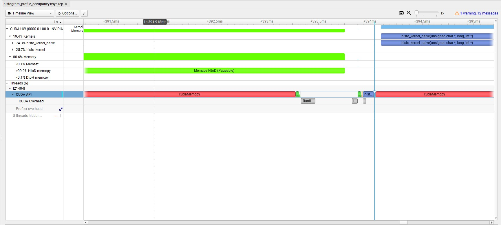

# Histogram

Counts occurrences of `a`–`z` in a byte buffer, bucketed into 7 groups of 4
letters each (`[a-d]`, `[e-h]`, ... `[y-z]`).

## Coalesced memory access

Each thread starts at `tIdx = blockIdx.x * blockDim.x + threadIdx.x` and
advances by `stride = blockDim.x * gridDim.x` per iteration. At every step,
consecutive threads (`threadIdx.x`, `threadIdx.x + 1`, ...) read consecutive
bytes (`buffer[tIdx]`, `buffer[tIdx + 1]`, ...). The GPU can merge these
per-thread reads into one wide memory transaction instead of issuing a
separate transaction per thread — this merging is coalescing, and it's why
threads are indexed to walk the buffer in lockstep rather than each owning a
separate contiguous chunk.

## Atomic operations

Multiple threads incrementing the same histogram bin is a classic
read-modify-write hazard: two threads can both read the old count, both add
1, and both write back the same new value — one increment is silently lost.
`atomicAdd` makes the read-modify-write indivisible at the hardware level, so
concurrent increments to the same address always accumulate correctly.

## Why the data race happens

Without atomics, `d_histoBuff[bin]++` compiles to a load, an add, and a
store as three separate steps. If thread A and thread B both target the same
bin, their loads/adds/stores can interleave in a way that drops an update.
This isn't a hypothetical here — with 256 threads per block and only 7 bins,
collisions on the same bin are frequent, not an edge case.

## Block-level privatization

Instead of every thread atomically updating a single histogram in global
memory (`histo`), each block keeps its own copy in shared memory
(`d_histoBuff[7]`). Threads within a block still contend with each other via
atomics on this shared copy, but blocks no longer contend with *each other*
over global memory — that contention is far more expensive since global
memory has much higher latency than shared memory. After each block finishes
accumulating locally, it does one atomic merge per bin into the global
`histo` array. This is why the kernel synchronizes twice: once after zeroing
the shared buffer, and once after all threads finish accumulating into it,
before the final merge.

## Register-level privatization

Block-level privatization still leaves every thread in a block contending
for the same 7 addresses in shared memory — with 256 threads per block, that's
still frequent collisions on `atomicAdd(&d_histoBuff[bin], ...)`. Register
privatization adds one more level underneath: each thread keeps its own
`reg_histoBuff[7]` in registers and, while walking its grid-stride loop,
increments its private copy with a plain `reg_histoBuff[bin]++` — no atomics,
no contention, since no other thread can see or touch another thread's
registers. Only after the loop finishes does each thread merge its 7
private counts into the shared block histogram, via one `atomicAdd` per
non-zero bin. This turns atomic traffic from "one atomic per byte processed"
into "at most 7 atomics per thread, total," regardless of how much of the
buffer that thread walked.

## Launch config: sizing the grid to the GPU, not the input

The naive way to size a grid-stride kernel is
`gridDim = (size + blockDim - 1) / blockDim` — just enough blocks to cover
`size` elements in one pass. This is a trap for privatization: at large
`size`, it produces roughly one thread per element, so the grid-stride
`while` loop only ever runs once (or zero times) per thread. Register
privatization's entire benefit comes from *amortizing many increments into
one atomic merge* — with one element per thread, there's nothing to amortize,
so the kernel pays privatization's fixed costs (shared-memory zeroing, two
`__syncthreads()`, a 7-element merge loop per thread) for zero benefit. This
was measured directly: on a 100MB input with a size-scaled grid, the naive
kernel (6.02ms) *beat* the privatized one (9.58ms).

The fix is to decouple grid size from input size entirely and size it off
the GPU instead, so every thread strides across many elements regardless of
how large the input gets:

```cpp
int numBlocksPerSm = 0;
cudaOccupancyMaxActiveBlocksPerMultiprocessor(&numBlocksPerSm, histo_kernel, blockDim.x, 0);
dim3 gridDim(deviceProp.multiProcessorCount * numBlocksPerSm);
```

`cudaOccupancyMaxActiveBlocksPerMultiprocessor` reports how many blocks of
*this exact kernel* — given its actual register and shared-memory usage —
can be simultaneously resident on one SM. Multiplying by the SM count gives
a grid that keeps every SM fully occupied without over-launching. On the
GTX 1650 used for this benchmark (14 SMs), that resolved to 4 blocks/SM →
56 blocks total, launched regardless of whether the input is 10KB or 1GB.

## Measured results (Nsight Systems)

10MB test input on the launch config above (GTX 1650, 14 SMs):

| Kernel | Total time | Notes |
|---|---|---|
| `histo_kernel_naive` (plain global `atomicAdd`, no privatization) | 6.05 ms | every hit contends on global memory directly |
| `histo_kernel` (block + register privatization) | 2.09 ms | atomics only at the per-block merge step |

**~2.9x faster** with privatization, once the grid is sized correctly. Both
kernels were verified to produce identical bucket counts on the same input
before comparing timing.

Captured with:
```powershell
nsys profile --trace=cuda,nvtx,cublas,cuDNN --output=histogram_profile histogram.exe
nsys stats --report cuda_gpu_kern_sum histogram_profile.nsys-rep
```

Deeper metrics (achieved occupancy, DRAM throughput, warp stall reasons via
`ncu` or `nsys --gpu-metrics-devices`) aren't in this report — both require
elevated GPU performance-counter access (`ERR_NVGPUCTRPERM`) that isn't
available in a standard user session on Windows; that's a next step for
whoever runs this from an administrator shell.



Zooming into the transfer window shown above: under `CUDA HW`, the
`Memcpy HtoD (Pageable)` bar runs from ~391.5ms to ~394ms, and *both* kernel
sub-rows (`histo_kernel_naive`, `histo_kernel`) are completely empty for that
entire span — neither kernel starts until the transfer has fully finished.
On the host side, `cudaMemcpy` blocks the CPU thread for the same duration,
so nothing useful happens concurrently on either the GPU or the CPU during
that ~2.5ms window.

## Next optimization: overlapping transfer with compute (planned)

The current version copies the entire input to the device with one
synchronous, pageable `cudaMemcpy` before either kernel launches — the
screenshot above is the direct evidence that transfer and compute never
overlap. The planned fix:

1. Allocate the host buffer with `cudaMallocHost` instead of `malloc` —
   pinned (page-locked) memory is a hard requirement for `cudaMemcpyAsync`
   to actually run asynchronously; on pageable memory it silently falls
   back to synchronous behavior.
2. Split the input into chunks and create one `cudaStream_t` per chunk.
3. For each chunk, issue `cudaMemcpyAsync(..., stream[i])` followed by
   `histo_kernel<<<..., stream[i]>>>(...)` on that same stream, all writing
   into the same `d_histo` via `atomicAdd` — safe even with several chunks'
   kernels running concurrently, since atomics are safe across streams, not
   just across blocks within one kernel.

Success criterion: in a re-profiled `CUDA HW` view, a chunk's
`Memcpy HtoD` bar and a *different* chunk's kernel bar should overlap
horizontally, instead of the kernel rows sitting empty under the transfer
bar as they do above.
